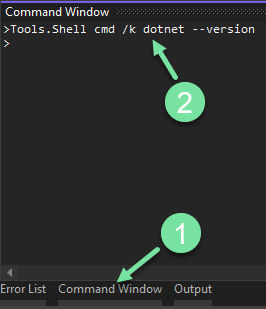

!!! info ""

    ### View disassembly code in the Visual Studio debugger (C#, C++, Visual Basic, F#)

    Source: [Microsoft](https://learn.microsoft.com/en-us/visualstudio/debugger/how-to-use-the-disassembly-window?view=vs-2022)

    #### To enable the Disassembly window
    
    - **Tools**
    - **Options**
    - **Debugging**
    - select **Enable address-level debugging**
    
    #### To open the Disassembly window during debugging
    
    - select **Windows**
    - **Disassembly** 
    **or**
    - **press Alt+8**

    Make sure this is selected [**Debug** > **Disassembly**]
    
    

    Put your breakpoint in then run the program
    
    


    ### Visual Studio Publish a self-contained exe

    This will help you publish your project into a single executable file, portable with no issues running on its own since all libraries and dependencies will be included into the executable file itself.

    Although you can use GUI Publish function, I myself had a better experience using the dotnet CLI method. First you will **launch the dotnet shell** through Visual Studio

    Open the `Command  Window` and then type in the following

    

    ```shell
    Tools.Shell cmd /k dotnet --version
    ```

    You will get this shell

    

    Keep in mind in below methods you will need to change the parameters to fit your needs, you could be compiling for a different Architecture or build for example.

    **Method 1**: Building using the project name, you will need to replace the `PROJECT_NAME`

    ```bash
    dotnet publish -r win-x86 -c Release --self-contained false -p:PublishSingleFile=true "PROJECT_NAME.csproj"
    ```

    **Method 2**: Building using the solution name, you will need to replace the `SOLUTION_NAME`

    ```bash
    dotnet publish -r win-x86 -c Release --self-contained false -p:PublishSingleFile=true "SOLUTION_NAME.sln"
    ```

    Resource: [Single-file deployment](https://learn.microsoft.com/en-us/dotnet/core/deploying/single-file/overview?tabs=cli#publish-a-single-file-app---visual-studio)
