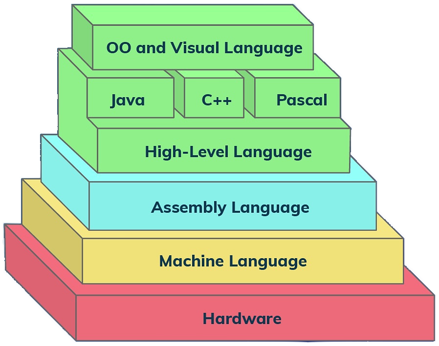

!!! info ""

    Assembly language depends on the CPU Architecture. An assembler translates mnemonics (e.g. jump, mov, add, etc.) from an assembly language into machine instructions. Machine instructions are entirely dependent on the hardware (they represent the hardware/CPU instruction set).
    The assembler implementation may (and generally is) OS-specific, because of the output program it produces (a Unix executable is not the same as a Windows executable, even though the underlying machine instruction set is x86, for example).

    Hierarchy of Programming Languages
    

!!! info ""

    #### Resources
    - [wikipedia Comparison of assemblers](https://en.wikipedia.org/wiki/Comparison_of_assemblers)
    - [wikipedia - Assembly language](https://en.wikipedia.org/wiki/Assembly_language)
    - [seattlewebsitedevelopers - Assembly Language](https://seattlewebsitedevelopers.medium.com/assembly-language-38e4b0edca0d)
      - [YT - javidx9](https://www.youtube.com/watch?v=1FXhjErUz58)
    - [gpfault - x86-64 Assembly](https://gpfault.net/posts/asm-tut-0.txt.html)
    - [tutorialspoint - NASM Assembly Programming Tutorial](https://www.tutorialspoint.com/assembly_programming/index.htm)
    - [Arm Assembly Language](https://developer.arm.com/documentation/107829/0200/Assembly-language-basics)
    - [virginia edu - x86 Assembly Guide](https://www.cs.virginia.edu/~evans/cs216/guides/x86.html)
    - [Intel's architecture manuals](https://www.intel.com/content/www/us/en/developer/articles/technical/intel-sdm.html#three-volume)
    - [Intel® 64 and IA-32 Architectures Software Developer Manuals](https://www.intel.com/content/www/us/en/developer/articles/technical/intel-sdm.html)
    - [wikibooks - x86 Assembly](https://en.wikibooks.org/wiki/X86_Assembly)
    - [Jonathan Bartlett - Programming from the Ground Up](https://www.cs.princeton.edu/courses/archive/spr08/cos217/reading/ProgrammingGroundUp-1-0-lettersize.pdf)
    - [NASM Assembly Language Tutorials - asmtutor](https://asmtutor.com/)
    - [Webster](https://www.plantation-productions.com/Webster/)

!!! info ""

    #### View disassembly code in the Visual Studio debugger (C#, C++, Visual Basic, F#)

    Source: [Microsoft](https://learn.microsoft.com/en-us/visualstudio/debugger/how-to-use-the-disassembly-window?view=vs-2022)

    To enable the Disassembly window, under **Tools** > **Options** > **Debugging**, select **Enable address-level debugging**
    To open the Disassembly window during debugging, select **Windows** > **Disassembly** or **press Alt+8**

