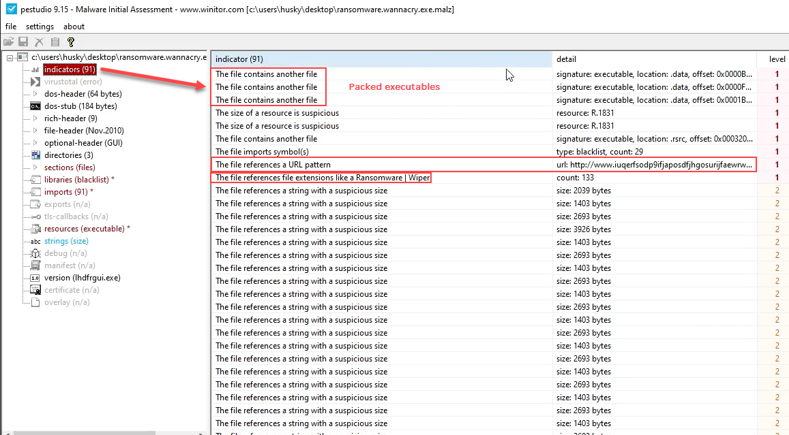

!!! info ""

    ### Tools list

    #### FLARE-VM Tool List

    - [strings/FLOSS](https://github.com/mandiant/flare-floss)
    - [PEView](http://wjradburn.com/software/)
    - [upx (not used but referenced)](https://upx.github.io/)
    - [PEStudio](https://www.winitor.com/download)
    - [Capa](https://github.com/mandiant/capa)
    - [Wireshark](https://www.wireshark.org/)
    - [Sysinternals (Procmon, TCPView)](https://learn.microsoft.comn-us/sysinternals/downloads/) | [Download sysinternals all](https://download.sysinternals.com/files/SysinternalsSuite.zip)
    - [nc/ncat](https://nmap.org/download)
    - [Cutter](https://github.com/rizinorg/cutter)
    - [x32/x64dbg](https://x64dbg.com/)
    - [Process Hacker 2 (now known as System Informer)](https:/ysteminformer.sourceforge.io/)
    - [scdbg](https://github.com/dzzie/SCDBG)
    - [dnSpy/dnSpyEx](https://github.com/dnSpyEx/dnSpy)
    - [PEBear](https://hshrzd.wordpress.com/pe-bear/)
    - [YARA](https://github.com/VirusTotal/yara)

    #### REMnux Tool List

    - base64 (built in Linux bin)
    - [OLEdump](https://github.com/DidierStevens/DidierStevensSuite/blob/master/oledump.py)
    - [MobSF github](https://github.com/MobSF/Mobile-Security-Framework-MobSF) | [(Docker Container)](https://hub.docker.com/r/opensecurity/mobile-security-framework-mobsf/)
	- [INetSim](https://www.inetsim.org/)


!!! info ""

    ### Get your Malware here
    - [PMAT Labs](https://github.com/HuskyHacks/PMAT-labs)
    - [theZoo](https://github.com/ytisf/theZoo)
    - [vx-underground main site](https://www.vx-underground.org/)
    - [vx-underground GitHub repo](https://github.com/vxunderground/MalwareSourceCode)
    - [Zeltser Resources](https://zeltser.com/malware-sample-sources/)
    - [MalwareBazaar](https://bazaar.abuse.ch/###)


!!! info ""

    ### Basic Static Analysis

    **Basic**: Limited Triage approach to the tools and techniques we are using

    **Static**: Not running the binary

    !!! info ""
        
        #### Pull the file hashes (Sha256 and MD5)

        ```bash
        sha256sum.exe <Malware_file_name>
        md5sum.exe <Malware_file_name>
        ```

        Search for those hashes in [VirusTotal](https://www.virustotal.com/gui/home/search)


    !!! info ""

        #### strings

        Extract the Binary strings, you can use **strings** or **FLOSS**.
        Floss will pull any array of Char > len(4) and terminated with a NullByte

        ```bash
        floss <Malware_file_name>
        ```

        Look through the output for any usable information, one of the most telling is the FLOSS static Unicode strings. Keep in mind that someone could put that there in purpose to mislead you while Analyzing the Malware sample.

    !!! info ""

        #### PEView
        
        run PEView > folder browser select "All File (*.*)" > locate your Malware sample > Click Open > It should load your Malware into the program

        **pFile** column: the offset of the Bytes, where in relation to the beginning of the Program did these Bits exist

        **Value** column: Char representation of the Bytes. Value MZ is a Windows EXE (Magic Byte tells what the file signature is)

        !!! example ""
            If you want to learn more about [Magic Bytes](https://www.netspi.com/blog/technical-blog/web-application-pentesting/magic-bytes-identifying-common-file-formats-at-a-glance/)

            [Interesting way of abusing the Magic Byte](https://medium.com/@d.harish008/what-is-a-magic-byte-and-how-to-exploit-1e286da1c198)

        **IMAGE_MT_HEADERS** > IMAGE_FILE_HEADER > Time Date Stamp
        - This is the time of build but sometimes this can be incorrect.
        - If the program was compiled with borland delphi compiler, the compile date will always be 1992
        
        **IMAGE_SECTION_HEADER.text**
        - **Virtual Size** (The amount of the data on disk when the Binary is run) & **Size of Raw Data **
        - Compare these HEX value using calc HEX
        - If the **Size of Raw Data ** < **Virtual Size** this could mean it's a packed Binary
          - In packed Binary the difference is very significant
          - 

        **SECTION.rdata** > IMPORT_Address_Table
        
        !!! info ""
            This section is important because of the Windows API (Application Programming Interface)
            - APIs are readily accessible to C and C++ developers, other languages like C# and Rust require wrappers or bindings in order to access these APIs. Source [Windows Developer Blog - making win32 apis more accessible](https://blogs.windows.com/windowsdeveloper/2021/01/21/making-win32-apis-more-accessible-to-more-languages/)
            - What this means is that Malware creators can also make use of the Windows API.
            - [Windows win32 API](https://learn.microsoft.com/en-us/windows/win32/api/)
            
            

        Going back to the **IMPORT_Address_Table**
        
        !!! warning ""
            **unpacked Malware**
            
            You can see all the Windows API Calls under the Value column for **IMPORT_Address_Table**

                    

        !!! warning ""
            **packed Malware**

            You will see the packer name UPX in this case `SECTION UPX`
            You won't see all the Windows API calls under the Value column for **IMPORT_Address_Table**
            **LoadLibraryA** & **GetProcAddress** are used to identify other imports at runtime, on runtime it will go find the API calls from the dlls it loads in.

            

        For example if we see ShellExecuteW, we can google for "Windows API Shell ExecuteW", first link gets us to [nf-shellapi-shellexecutea](https://learn.microsoft.com/en-us/windows/win32/api/shellapi/nf-shellapi-shellexecutea) which will explain the API call function.

        Now if you want to get to the point and see exactly what could be malicious, you can check [**MalAPI.io**](https://malapi.io/)


    !!! info ""

        #### 


    !!! info ""

        #### 


    !!! info ""

        #### 


    !!! info ""

        #### 


    !!! info ""

        #### 


    !!! info ""

        #### 


    !!! info ""

        #### 


    !!! info ""

        #### 


    !!! info ""

        #### 


