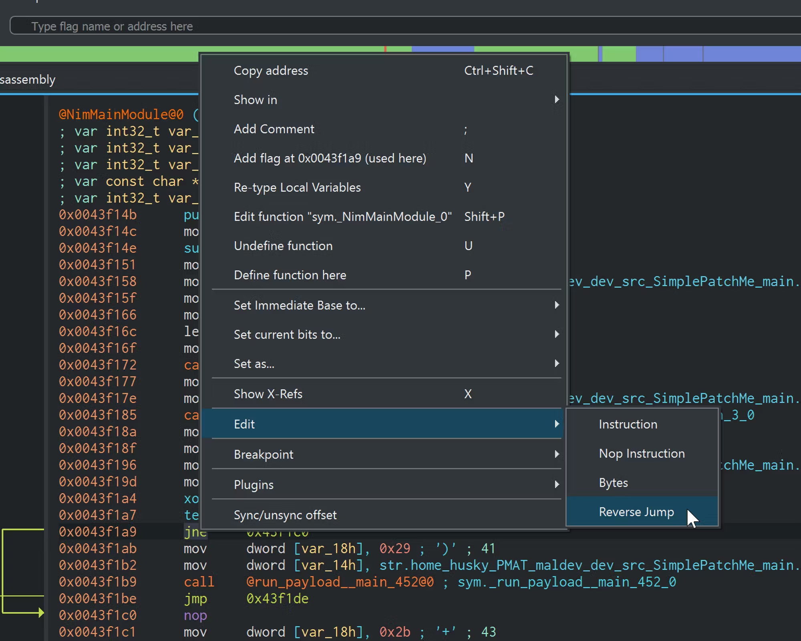
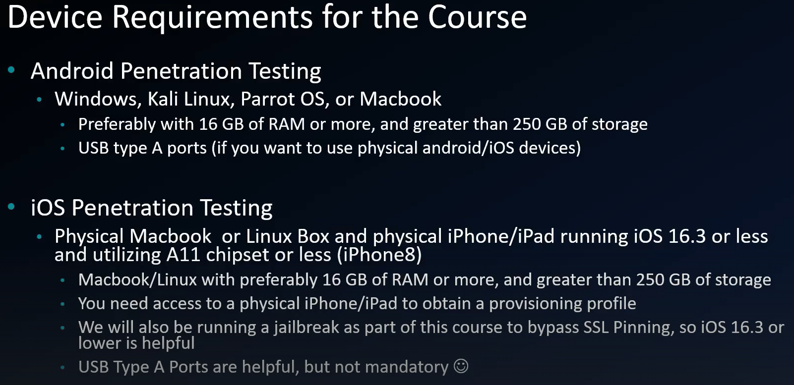
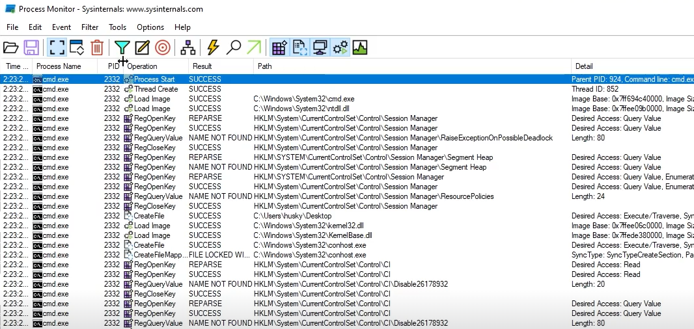
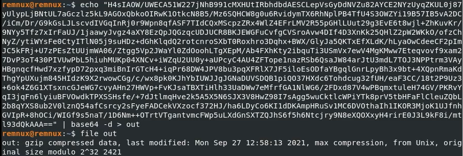

!!! info ""

    ### Tools list

    ??? info "FLARE-VM"
        #### FLARE-VM Tool List

        - [strings/FLOSS](https://github.com/mandiant/flare-floss)
        - [PEView](http://wjradburn.com/software/)
        - [upx (not used but referenced)](https://upx.github.io/)
        - [PEStudio](https://www.winitor.com/download)
        - [Capa](https://github.com/mandiant/capa)
        - [Wireshark](https://www.wireshark.org/)
        - [Sysinternals (Procmon, TCPView)](https://learn.microsoft.comn-us/sysinternals/downloads/) | [Download sysinternals all](https://download.sysinternals.com/files/SysinternalsSuite.zip)
        - [nc/ncat](https://nmap.org/download)
        - [Cutter](https://github.com/rizinorg/cutter)
        - [x32/x64dbg](https://x64dbg.com/)
        - [Process Hacker 2 (now known as System Informer)](https:/ysteminformer.sourceforge.io/)
        - [scdbg](https://github.com/dzzie/SCDBG)
        - [dnSpy/dnSpyEx](https://github.com/dnSpyEx/dnSpy)
        - [PEBear](https://hshrzd.wordpress.com/pe-bear/)
        - [YARA](https://github.com/VirusTotal/yara)

    ??? info "REMnux"
    
        #### REMnux Tool List

        - base64 (built in Linux bin)
        - [OLEdump](https://github.com/DidierStevens/DidierStevensSuite/blob/master/oledump.py)
        - [MobSF github](https://github.com/MobSF/Mobile-Security-Framework-MobSF) | [(Docker Container)](https://hub.docker.com/r/opensecurity/mobile-security-framework-mobsf/)
        - [INetSim](https://www.inetsim.org/)


!!! info ""

    ### Get your Malware here
    - [PMAT Labs](https://github.com/HuskyHacks/PMAT-labs)
    - [theZoo](https://github.com/ytisf/theZoo)
    - [vx-underground main site](https://www.vx-underground.org/)
    - [vx-underground GitHub repo](https://github.com/vxunderground/MalwareSourceCode)
    - [Zeltser Resources](https://zeltser.com/malware-sample-sources/)
    - [MalwareBazaar](https://bazaar.abuse.ch/###)


!!! info ""

    ### Basic Static Analysis

    **Basic**: Limited Triage approach to the tools and techniques we are using

    **Static**: Not running the binary

    ??? info "Binary Hashes"
        
        #### Pulling the Binary Hashes

        Pull the file hashes (Sha256 and MD5)

        ```bash
        sha256sum.exe <Malware_file_name.extension>
        md5sum.exe <Malware_file_name.extension>
        ```

        If using Cmder

        ```powershell
        Get-filehash -Algorithm SHA256 <Malware_file_name.extension>
        ```

        Submit the hashes to [VirusTotal](https://www.virustotal.com/gui/home/search) and see if you get something promising back!


    ??? info "Binary strings"

        #### strings

        Extract the Binary strings, you can use **strings** or **FLOSS**.
        Floss will pull any array of Char > len(4) and terminated with a NullByte

        ```bash
        floss <Malware_file_name.extension>

        #-n will look for a minimum string length of 8, you can change the value based on your needs.
        floss -n 8 <Malware_file_name.extension>
        ```

        Look through the output for any usable information, one of the most telling is the FLOSS static Unicode strings. Keep in mind that someone could put that there in purpose to mislead you while Analyzing the Malware sample.

    ??? info "Portable Executable Viewer - PEView"

        #### PEView
        
        run PEView > folder browser select "All File (*.*)" > locate your Malware sample > Click Open > It should load your Malware into the program

        **pFile** column: the offset of the Bytes, where in relation to the beginning of the Program did these Bits exist

        **Value** column: Char representation of the Bytes. Value MZ is a Windows EXE (Magic Byte tells what the file signature is)

        !!! example ""
            If you want to learn more about [Magic Bytes](https://www.netspi.com/blog/technical-blog/web-application-pentesting/magic-bytes-identifying-common-file-formats-at-a-glance/)

            [Interesting way of abusing the Magic Byte](https://medium.com/@d.harish008/what-is-a-magic-byte-and-how-to-exploit-1e286da1c198)

        **IMAGE_MT_HEADERS** > IMAGE_FILE_HEADER > Time Date Stamp
        - This is the time of build but sometimes this can be incorrect.
        - If the program was compiled with borland delphi compiler, the compile date will always be 1992
        
        **IMAGE_SECTION_HEADER.text**
        - **Virtual Size** (The amount of the data on disk when the Binary is run) & **Size of Raw Data **
        - Compare these HEX value using calc HEX
        - If the **Size of Raw Data ** < **Virtual Size** this could mean it's a packed Binary
          - In packed Binary the difference is very significant
          - 

        **SECTION.rdata** > IMPORT_Address_Table
        
        !!! info ""
            This section is important because of the Windows API (Application Programming Interface)
            - APIs are readily accessible to C and C++ developers, other languages like C# and Rust require wrappers or bindings in order to access these APIs. Source [Windows Developer Blog - making win32 apis more accessible](https://blogs.windows.com/windowsdeveloper/2021/01/21/making-win32-apis-more-accessible-to-more-languages/)
            - What this means is that Malware creators can also make use of the Windows API.
            - [Windows win32 API](https://learn.microsoft.com/en-us/windows/win32/api/)
            
            

        Going back to the **IMPORT_Address_Table**
        
        !!! warning ""
            ##### unpacked Malware
            
            You can see all the Windows API Calls under the Value column for **IMPORT_Address_Table**

                    

        !!! warning ""
            ##### packed Malware

            You will see the packer name UPX in this case `SECTION UPX`
            You won't see all the Windows API calls under the Value column for **IMPORT_Address_Table**
            **LoadLibraryA** & **GetProcAddress** are used to identify other imports at runtime, on runtime it will go find the API calls from the dlls it loads in.

            

        For example if we see ShellExecuteW, we can google for "Windows API Shell ExecuteW", first link gets us to [nf-shellapi-shellexecutea](https://learn.microsoft.com/en-us/windows/win32/api/shellapi/nf-shellapi-shellexecutea) which will explain the API call function.

        Now if you want to get to the point and see exactly what could be malicious, you can check [**MalAPI.io**](https://malapi.io/)


    ??? info "Portable Executable Studio - PEStudio"

        #### PEStudio

        Before we get into it, always keep in mind the type of application and it's functionality when looking for file signatures. In below example you can see ShellExecuteA but the application is putty, which is a part of its functionality.

        

        Run PEStudio > file > open file > select the malware sample > click Open

        PEStudio simplifies the early stages, when using Basic Static Analysis. For example it gives you the hashes right away, runs strings and presents many more pieces of information.

        


    ??? info "Detecting executable capabilities"

        #### [CAPA](https://github.com/mandiant/capa)

        CAPA detects malicious capabilities in suspicious programs by using a set of rules. Capa has a default rule set, but also has an open-source repository of rules [**CAPA rule repository**](https://github.com/mandiant/capa-rules)

        

        

        From the output we can then use the [**MITRE ATT&CK Framework**](https://attack.mitre.org/). In our example we have T1129, we can check that out through this link [MITRE T1129](https://attack.mitre.org/techniques/T1129/)


!!! info ""

    ### Basic Dynamic Analysis

    Also known as **Heuristic** or **Behavioral** Analysis. Dynamic Analysis means that we will execute/run the Malware and Analyze it.

    We will be looking for **Host Indicators** (Like deleting a local file) & **Network Indicators** (like calling out to the Internet to download a file).

    ??? info "Network Signatures"

        #### Hunting for Network Signatures

        Make sure all the tools are ready before executing the Malware (RemNux, Wireshark Capture on RemNux)

        We can start by looking for the Network Signatures now, based on the Static Analysis we did, we gathered possibly a domain name or a file name it's calling for. We can look for those into our Wireshark Capture.

        Once Network Signatures is complete, we can rollback out VM then run the Malware again to check for Local Signatures.


    ??? info "Local Signatures"

        #### Local Signatures - Procmon

        ??? info "Procmon overview"
        
            ##### overview

            Open Procmon > Click the Filter > setup the filter and click OK

            

            Since we know the process name we can setup something like this
            
            

            You won't see any events until you run the Malware sample

            

            You will now need to sift through the Operations 

            For example in the Static Analysis Stage we found a path with an exe name when we ran strings on the sample, after filtering through operations we found the same path

            

            Now we can go to that path and see what that executable is doing.

            **Keep going through all the interesting strings to gather more information**, try to extract the Malware flow such as if it deletes itself, call to download a file and so on.

            

        ??? info "Procmon common filters"

            ##### procmon filters

            **Common Operations filters**:

            - CreateFile: When a process wants to create a file.
            - WriteFile: When a process writes data to a file.
            - SetRenameInformationFile: When a rename operation occurs on a file.
            - SetDispositionInformationFile: When a file deletion occurs on a file.
            - RegCreateKey: When registry key is created.
            - RegSetValue: When the data for value is set in the registry
            - RegDeleteKey: When a key gets deleted from the registry.
            - RegDeleteValue: When a value gets deleted from the registry.
            - TCP Connect, TCP Receive, UDP Send, UDP Receive: Process is Sending / - Receiving a TCP or UDP connection.
            - Load Image: When a process loads any DLL’s / Executables.
            - Process Create: When a process creates a process.
            - CreatePipe: When a process creates a Pipe.

            **Resources**:

            - [motiba](https://learn.microsoft.com/en-us/archive/blogs/motiba/process-monitor-for-dynamic-malware-analysis)
            - [system_monitor](https://github.com/wuanzhuan/system_monitor?tab=readme-ov-file)
            - [Lonebear69 filter import](https://github.com/Lonebear69/https-github.com-tanc7-procmon-filters)
            - [mindmap](https://www.mindmeister.com/app/map/55334446?fullscreen=1&v=public)


    ??? info "TCP View"

        #### TCP View

        Having TCP View running when we run the malware sample, we can then check the ports the malware is requesting.

        

        If we see one that's listening, we can go back to our RemNux machine and netcat `nc` that port to interact with the Malware and see what happens

        

        nc result

        

        decode the result with base64

        

        Now we know what it's asking for, a command. We ran the `ipconfig` and came back with a result

        

        decoded the result and it's showing us the network adapter configuration

        

        So the above tells us it had command injection capability

        We now can run procmon while interacting with the Malware sample

        

        We can see that it's sending the results back

        


    ??? info "Process Tree"

        #### Process Tree

        You will need to de-chain/decouple the Parent Child Process relationship.
        
        

        Knowing the PID for the parent process, we can now filter Procmon using Parent PID

        

        


    !!! info "Encoded files"

        #### Extracting encoded file

        Lets say you found a base64 string in a command running through powershell.exe

        

        You can extract that string and decode it, then get the file type of whatever it decoded to

        

        ```bash
        #decode to a file called out and has no file extension
        echo "XXX_VALUE_XXX" | base64 -d > out
        
        #figure out the file type
        file out
        
        #we can see in the example we have a gzip file
        #now you can extract the file and check its contents
        ```

!!! info ""

    ### Advanced Static Analysis: Assembly Language, Decompiling, & Disassembling Malware


    ??? info "Analysis & Assembly"

        #### Advanced Analysis & Assembly Language


    ??? info "Disassembling & Decompiling"

        #### Disassembling & Decompiling a Malware Dropper: Intro to Cutter


    ??? info "x86 CPU"

        #### x86 CPU Instructions, Memory Registers, & the Stack


    ??? info "Assembly Instructions & Windows API"

        #### Dropper: Assembly Instructions and the Windows API


    ??? info "Under a Microscope"

        #### Hello, World! Under a Microscope Part I


    ??? info "Advanced Analysis of a Process Injector"

        #### Advanced Analysis of a Process Injector


!!! info ""

    ### Advanced Dynamic Analysis: Debugging Malware


    ??? info "Flow Control & Breakpoints"

    #### x32dbg: Flow Control & Breakpoints


    ??? info "Dynamic Analysis of x86"

    #### Debugging the Dropper: Dynamic Analysis of x86 Instructions & API Calls


    ??? info "Under a Microscope"

    #### Hello, World! Under a Microscope Part II


!!! info ""

    ### SikoMode

    ??? info ""

    #### 


    ??? info ""

    #### 


    ??? info ""

    #### 


    ??? info ""

    #### 


    ??? info ""

    #### 


!!! info ""

    ### Binary Patching & Anti-analysis


    ??? info ""

    #### 


    ??? info ""

    #### 


!!! info ""

    ### Specialty Malware Classes

    ??? info ""

    #### 


    ??? info ""

    #### 


!!! info ""

    ### Gone Phishing: Maldoc Analysis

    ??? info ""

    #### 


    ??? info ""

    #### 


    ??? info ""

    #### 


!!! info ""

    ### What The Shell? Shellcode Analysis

    ??? info ""

    #### 


    ??? info ""

    #### 


    ??? info ""

    #### 


!!! info ""

    ### Off-Script: Scripted Malware Delivery Mechanisms


    ??? info ""

    #### 


    ??? info ""

    #### 


    ??? info ""

    #### 


!!! info ""

    ### Stay Sharp: Reversing C# Malware

    ??? info ""

    #### 


    ??? info ""

    #### 


    ??? info ""

    #### 


!!! info ""

    ### Go Time: Analyzing Go Malware

    ??? info ""

    #### 


    ??? info ""

    #### 


    ??? info ""

    #### 


!!! info ""

    ### Get Mobile! Mobile Malware Analysis

    ??? info ""

    #### 


    ??? info ""

    #### 


    ??? info ""

    #### 


!!! info ""

    ### The Bossfight! Analyzing Real-World Malware Samples

    ??? info ""

    #### 


    ??? info ""

    #### 


    ??? info ""

    #### 


!!! info ""

    ### Automation: Sandboxes & Pipelines

    ??? info ""

    #### 


    ??? info ""

    #### 


    ??? info ""

    #### 


!!! info ""

    ### Tell The World: Rule Writing & Report Publishing
    ??? info ""

    #### 


    ??? info ""

    #### 


    ??? info ""

    #### 


??? info "mindmaps"

    

    
