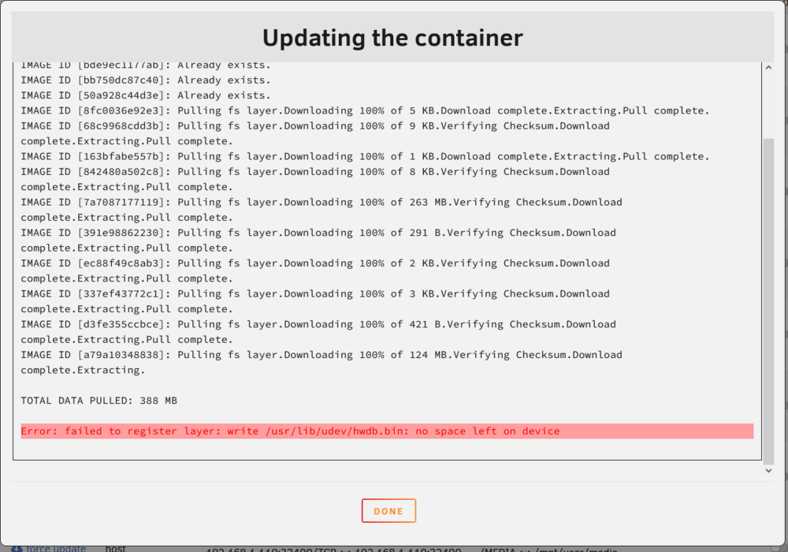
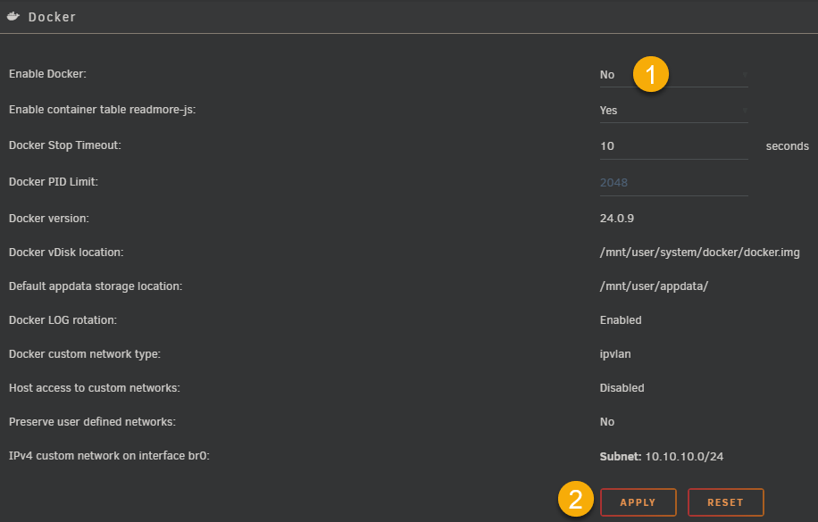
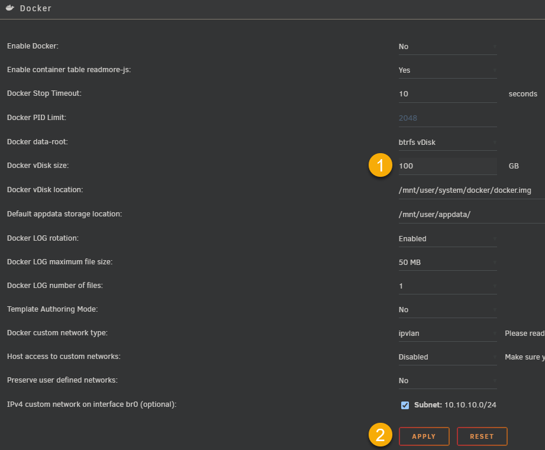
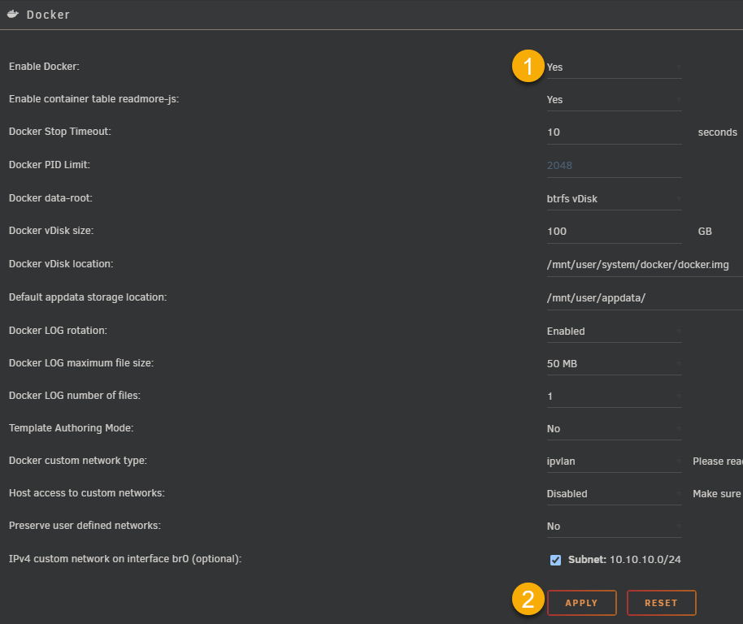

!!! error "Error: failed to register layer: write /usr/lib/x86_64-linux-gnu/libcudnn_engines_precompiled.so.9.6.0: no space left on device"

    ### Error: failed to register layer: write /usr/lib/x86_64-linux-gnu/libcudnn_engines_precompiled.so.9.6.0: no space left on device

    If you receive the error message above, you need to check if your Docker volume has enough space

    

    Navigate to 'SETTINGS' > 'Docker' > Enable 'ADVANCED VIEW'

    Scroll down to 'Docker volume info' and check the 'btrfs filesystem show' section

    The default is usually 20 GB, if you dop see it full, follow the next steps

    ```bash
    Label: none  uuid: xxxxxx-fea5-xxxxxxx-a7b4-xxxxxx
	Total devices 1 FS bytes used 16.76GiB
	devid    1 size 20.00GiB used 20.00GiB path /dev/loop2
    ```

    

    

    
