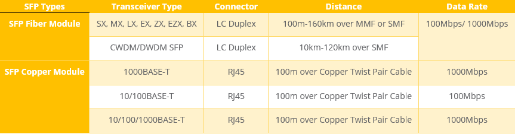
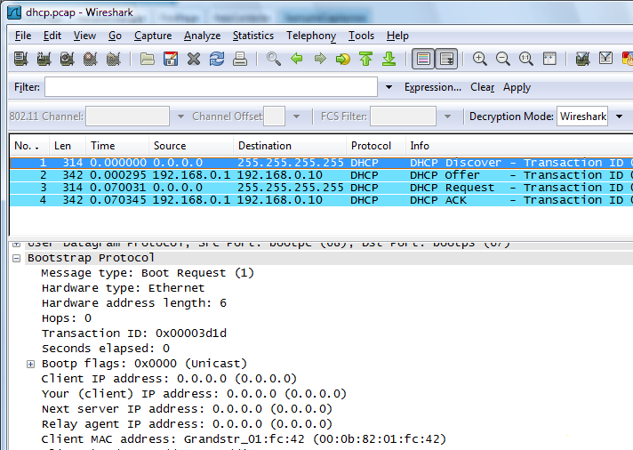

!!! info ""

    #### Fiber Cable Types

    ##### Single mode fiber
    Long Haul [LX] | Long Distances up to 5 KM
    Uses Laser as light source
    Higher cost
    Usually Yellow in color
    Supports both Simplex & Duplex
    Much thinner at 8.3-10 microns

    

    ##### Multimode fiber
    Short Haul [SX] | Short Distances
    Uses LED as light source
    Lower cost
    Usually Orange in color
    Supports both Simplex & Duplex
    Thicker at 50-100 microns

    

!!! info ""

    #### Connector Types
    
    ##### ST connectors [Straight Tip]

    These connectors are the most common type of commercial fiber optic connector. These connectors utilize an exposed plastic tube housing the optical fiber. This requires a connection to a matching cable on the other side, incorporating a connector that mates to the other.

    These combine in a spring-loaded twist, reminiscent of BNC connectors, and are noted for their reliability. ST connector is very popular in communication applications, such as LANs and CCTV systems. used Fiber optic connectors in networking applications

    {: style="height:180px;width:200px"}

    ##### SC-Connector [Subscriber Connect]

    SC is short for Subscriber Connect is one of the most frequently used connectors. Used in fiber-optic networking, it has caps to prevent laser light reaching eyes. The connector usually in pairs (transmit and receive), often clipped together. connectors have the ferrule that houses the fiber mostly concealed. Probably the most similar commercial equivalent off to slink, SC connectors does not require a mating cable on the other side. Instead, these Snap-On connectors simply push into their jacks with a click. SC connectors use a push-pull design and can be used for simplex or multiplex applications

    {: style="height:170px;width:200px"}

    ##### FC connector [Ferrule connector]

    It is similar to ST connectors, these fiber optic connector's screws into their mating jacks. Additionally, the tube surrounding the optical fiber is typically shrouded in ceramic or metal, as opposed to being fully exposed. The inner ring of the connector is keyed to ensure positive mating to its corresponding jack. FC connectors are primarily used with single mode fibers and used in telephone, instruments, and high-speed communication links. The style is similar to that of an ST connector, but it uses a threaded connection which makes it better suited for high vibration environments

    {: style="height:180px;width:200px"}

    ##### LC cables [Lucent Connector]

    latch and release into their jacks in a manner similar to Ethernet connectors. Smaller in form than SC connectors, their durability is not compromised, nor is cost increased. Instead of snapping or thermo forming the connector to the cable, it is glued. This makes it a popular connector for field use. LC connectors are used in private and public networks, and are gaining in popularity due to their small form factor (SFF) optical transmitter/receiver assembly

    Below LC has 2 pairs, LC can also come in single connnector form
    {: style="height:180px;width:200px"}

!!! info ""

    #### Fiber Patch Cable Types

    ##### LC to LC

    {: style="height:200px;width:200px"}
   
    ##### LC to SC

    {: style="height:200px;width:200px"}

    ##### LC to FC

    {: style="height:200px;width:200px"}  

    ##### LC to ST

    {: style="height:200px;width:200px"}
    
    ##### SC to SC

    {: style="height:200px;width:200px"}
    
    ##### SC to ST

    {: style="height:200px;width:200px"}
    
    ##### ST to ST

    {: style="height:200px;width:200px"}

!!! info ""

    #### Fiber Patch Modes

    ##### Single mode fiber patch cable

    - Long Distances
    - Mostly use over large areas such as Campuses, TV networks

    ##### Multimode fiber patch cable

    - Short distances
    - Most Used in LAN applications
    - Aqua patch cables are higher performance 10Gbps, 40Gbps, and 100Gbps - Ethernet and fiber channel applications.
    
    **Fiber Cables Distance**
    

    **Note:**
    - 1000 Base-SX = SX = "short haul"
    - 1000 Base-LX = LX = "Long haul"

 
!!! info ""

    #### Types of Single Mode Fiber Cable and Specifications
    

    ##### OS1 Single Mode Tight Buffered Cable
    - Indoor Use: Used in LANs and point-to-point links in cities, buildings, factories, office parks or campuses
    - Distance 2 KM
    - Construction Tight Buffered [manufactured into solid medium]
    - Attenuation 1.0db/km
    - Less Expensive
    - OS1 can support speeds up to 10G and distances up to about 10 KM

    
    

    ##### OS2 Single Mode Loose Tube Cable
    - Outdoor use: Used in street, underground/burial, etc.…
    - Distance 10 KM
    - Construction Loose Tube [not held in medium but blown or otherwise inserted into carrier]
    - Attenuation 0.4db/km
    - More expensive

    
    
    ##### Single Mode Polish Types
    
    {: style="height:350px;width:400px"}

    {: style="height:350px;width:400px"}

    UPC and APC connectors cannot be mated due to the angle of the APC connector. The connector types are not interchangeable. Always
    verify the type of connector required. If a single mode connector is recommended and no polish is specified, utilize UPC connectors. If APC
    connectors are required, you must install APC connectors.

!!! info ""

    #### Connector Color Codes

    Note: Cable colors are not set in stone and can't fully depend on them.

    Color-coding varies by manufacturer

    Connectors are often color-coded for easy identification. The chart below shows this with LC connectors.

    

!!! info "" 

    #### What is meant by Attenuation in Networking?

    Attenuation is the gradual loss of signal strength over a distance and it’s measured in dB decibels. This loss can be caused by a distortion, interference, noise, distance, physical surrounding (temperature, walls, wire insulation), etc..

    

    #### What is a good Attenuation?

    A good Attenuation is that one that can hold great signal strength over long istances and the more it can the hold the better.

    So, when we look at OS1 vs OS2 cables you will notice that OS1 with 1.0 dB/KM has only a distance of 2 KM and OS2 with 0.4 dB/KM has a distance of 10 KM. The lower the Attenuation the less signal you are losing over a distance which in turn will lead to increased distance with a good signal strength.

    But always remember that these are just number and not set in stone, these are a lot of factors that can impact a signal Attenuation.

!!! info ""

    #### What type of media can be affected by Attenuation?
    - Copper Cables
    - Fiber Cables
    - Satellite
    - Radio Signals
    - Wireless Networks

!!! info ""

    #### Types of Multimode Fiber Cable and Specifications

    ##### OM1

    - Jacket Color – Orange
    - Application – Short-haul networks, Local Area Networks (LANs) & private - networks

    {: style="height:250px;width:250px"}

    ##### OM2

    - Jacket Color – Orange
    - Application – Short-haul networks, Local Area Networks (LANs) & private - networks
    - Generally used for shorter distances. Has twice the distance capacity has OM1

    {: style="height:250px;width:250px"}

    ##### OM3 – Laser-Optimized Multimode

    - Jacket Color – Aqua
    - Uses fewer modes of light, enabling increased speeds
    - Able to run 40GB or 100GB up to 100 meters utilizing an MPO connector
    - Application – Larger Private Networks

    {: style="height:200px;width:250px"}

    ##### OM4 – Laser Optimized Multimode

    - Jacket Color – Aqua
    - Able to run 100GB up to 150 meters utilizing an MPO connector
    - Application – High-Speed Networks, Data Centers, Financial Centers and - Corporate Campuses

    {: style="height:300px;width:250px"}

    ##### OM5 – The latest and greatest in Multimode Fiber

    - Jacket Color – Lime Green
    - Fully compatible and can mate with OM3 and OM4 cabling
    - Utilizes a wider range of wavelengths between 850nm and 953nm
    - Designed to support Short Wavelength Division Multiplexing (SWDM)
    - Can Transmit 40 Gb/s and 100 Gb/s
    - Application – High-speed Networks and Data Centers that require greater link - distances and higher speeds

    {: style="height:250px;width:250px"}

!!! info ""

    #### Fiber Cable History

    
