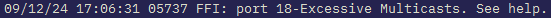

!!! info ""

    

    ### fault-finder multicast-storm


    ```shell
    switch(config)# fault-finder multicast-storm
    action                Configure the action taken when a fault is detected.
    [ethernet] PORT-LIST  The ports on which to enable Multicast Storm Control.
    sensitivity           Configure the fault sensitivity level.
    ```

    ```shell
    switch(config)# fault-finder multicast-storm ethernet
    PORT-LIST             Enter a port number, a list of ports or 'all' for all
                        ports.
    ```

    ```shell
    switch(config)# fault-finder multicast-storm ethernet 1/1
    action                Configure the action taken when a multicast storm is
                        detected.
    ```

    ```shell                                                      
    switch(config)# fault-finder multicast-storm ethernet 1/1 action
    warn                  Log an event only.
    warn-and-disable      Log an event and disable the port.
    ```

    ```shell
    switch(config)# fault-finder multicast-storm ethernet 1/1 action warn-and-disable

    SECONDS               Configure the number of seconds for which the port
                        remains disabled. A value of 0 means that the port will
                        remain disabled until manually re-enabled.
    ```

    ```shell
    switch(config)# fault-finder multicast-storm ethernet 1/1 action warn-and-disable 10

    percent               Configure the number of inbound multicast packets per
                        second that is considered a multicast storm. This
                        threshold is computed assuming a size of 64 bytes per
                        incoming multicast packet.
    pps                   Configure the number of inbound multicast packets per
                        second that is considered a multicast storm.
    ```

    ```shell
    switch(config)# fault-finder multicast-storm ethernet 1/1 action warn-and-disable 10 percent

    <1-100>               The percentage that is considered a multicast storm.

    switch(config)# fault-finder multicast-storm ethernet 1/1 action warn-and-disable 10 percent 40
    ```

    ```shell
    show fault-finder 
    show fault-finder multicast-storm
    show fault-finder multicast-storm 1/1
    ```

    
    ### fault-finder multicast-storm action

    ```shell
    switch(config)# fault-finder multicast-storm action warn
    sensitivity     Configure the fault sensitivity level.
    ```

    ```shell
    switch(config)# fault-finder multicast-storm action warn sensitivity
    low             Low sensitivity.
    medium          Medium sensitivity.
    high            High sensitivity.
    ```

    ```shell
    switch(config)# fault-finder multicast-storm action warn-and-disable
    sensitivity     Configure the fault sensitivity level.
    ```

    ```shell
    switch(config)# fault-finder multicast-storm action warn-and-disable sensitivity
    low             Low sensitivity.
    medium          Medium sensitivity.
    high            High sensitivity.
    ```

    ```shell
    switch(config)# fault-finder multicast-storm action warn-and-disable sensitivity high 
    ```

    ```shell
    show fault-finder
    ```

    ### show logging

    ```shell
    switch# show logging
    Keys:   W=Warning   I=Information
            M=Major     D=Debug E=Error

    ----  Event Log listing: Events Since Boot  ----
    I 01/07/90 20:22:55 00076 ports: port 3 is now on-line
    M 01/07/90 20:22:52 02677 FFI: port 3-Port enabled by Fault-finder.
    I 01/07/90 20:22:33 00077 ports: port 3 is now off-line
    M 01/07/90 20:22:33 02676 FFI: port 3-Re-enable after 20 seconds.
    M 01/07/90 20:22:33 02673 FFI: port 3-Port disabled by Fault-finder.
    M 01/07/90 20:22:33 02675 FFI: port 3-Excessive Multicast-storm control threshold 10 % exceeded.
    ```

    ### Restrictions

    Multicast storm control is not supported in the following scenarios.

    - Unicast packet traffic
    - If the port is configured as a VSF port
    - If the port is configured as a trunk port


    ### Resources

    - [fault-finder multicast-storm](https://www.arubanetworks.com/techdocs/AOS-S/16.11/MCG/WC/content/common%20files/fau-fin-mul-sto.htm)