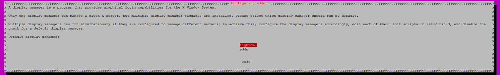

**Resources**
[lxqt-on-linux](https://www.addictivetips.com/ubuntu-linux-tips/lxqt-on-linux/)

**LXQt on Linux**

This package contains LXQt and various programs, apps, and a login session so you can use the desktop.
```bash
sudo apt install lubuntu-desktop
```

To start the installation of LXQt on Debian
```bash
sudo apt install lxqt
```

choose lightdm




??? note "note"
    note

??? abstract "abstract"
    abstract

??? info "info"
    info

??? tip "tip"
    tip

??? success "success"
    success

??? question "question"
    question

??? warning "warning"
    warning

??? failure "failure"
    failure

??? danger "danger"
    danger

??? bug "bug"
    bug

??? example "example"
    example

??? quote "quote"
    quote
