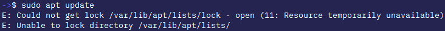
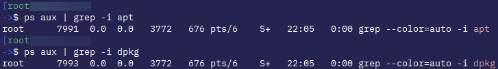

!!! info ""

    

    !!! warning ""

    ### Method #1: Check for Running Processes

    ```bash
    ps aux | grep -i apt
    ps aux | grep -i dpkg
    ```

    

    You could terminate the process using

    ```bash
    sudo kill <PID>
    # from above picture PID is second col from left. PID is 7991 and 7993 [Yours will be different]
    ```

    ### Method #2: Remove Lock Files Manually

    !!! warning ""

    Run the below commands and then attempt to run `sudo apt update`

    ```bash
    sudo rm /var/lib/apt/lists/lock
    sudo rm /var/cache/apt/archives/lock
    sudo rm /var/lib/dpkg/lock
    sudo rm /var/lib/dpkg/lock-frontend
    ```

    Above should solve the problem, but if doesn't, run `sudo dpkg --configure -a` then try to `sudo apt update`
