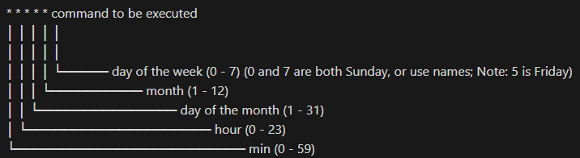

!!! info ""

    The crontab file has a specific syntax for defining the schedule of a task. Each line in the file represents a single task, and the line is made up of six fields separated by spaces, representing the schedule for when the task should run. The fields are as follows:

    

    For example, to run a task every day at 3:00 AM, the line in the crontab file would be:

    ```bash
    0 3 * * * <command>
    ```

    To schedule a task to run every day at 3:00 PM, the line in the crontab file would be:

    ```bash
    0 15 * * * <command>
    ```

    You can also use the special characters *, */n, a-b, , to configure the schedule.

    ```bash
    /5 * * * * <command> # run every 5 minutes
    0 3,6,9 * * * <command> # run at 3:00 AM, 6:00 AM, 9:00 AM
    ```

    To create or edit your crontab
    
    ```bash
    crontab -e
    ```
    
    #list current crontab
    
    ```bash
    crontab -l
    ```

    #remove current crontab
    
    ```bash
    crontab -r
    ```

    **crontab can run only shell commands, not scripts!**

    ```bash
    sudo apt-get update
    sudo apt-get install cron
    crontab -l

    #**If you see the output of** "*/30 * * * * python /var/www/py/testingpython.py"
    #**Then no need to adjust**

    #**Otherwise**
    sudo nano crontab -e
    1

    #hit page down a few times then paste and save changes
    */30 * * * * python3 /var/www/py/testingpython.py

    #IF CRONTAB NO WORKY, DO THIS
    cat /etc/cron.d/speedtest_cron

    #/**************** TEST! *********************/
    cd /var/www/py/
    python3 testingpython.py
    ```


!!! info ""

    ### Basic Cron Syntax

    There's a useful site called [Crontab Generator](http://crontab-generator.org/) that will calculate the setup of a cron job for you, but first we'll go through a brief overview of what a syntax will look like.

!!! info ""

    ### Example cron job

    ```bash
    * * * * /usr/bin/php /var/www/html/crontest/cron.php > /dev/null 2>&1
    ```

!!! info ""

    ### Parts of a cron command

    cron command parts:
    - timing
    - the command to execute
     
    In this example, the command includes three parts:

    |Timing|Execute|Path to script|Output|
    |:---|:---|:---|:---|
    |* * * * *|/usr/bin/php|/var/www/html/crontest/cron.php|> /dev/null 2>&1|

    - **Timing** - set the minutes, hours, days, months, and weekday settings (more below).
    - **Execute** - the cron job needs to call upon PHP to run, which is located at /usr/bin/php.
    - **Path to script** - the full path of the file you plan to run.
    - **Output** - (optional) you can write the output to a file or discard it - > /dev/null 2>&1 will discard.
        

    In the above example, the cron job is set to send every minute - or more specifically, every minute of every hour of every day of every month, every day of the week. An asterisk is a wildcard that stands for "all".

    - **Minutes** - set the minutes, from 0-59
    - **Hours** - set the hour, from 0-24
    - **Days** - set the day, from 1-31
    - **Months** - set the month, from 1-12 (January - December)
    - **Week** - set the day of the week, from 0-6 (Sunday - Saturday)
        

    Here are a few basic examples to get an idea of how it works.

    |Syntax|Explanation|
    |---|---|
    |0 * * * *|run once an hour (every hour at minute zero)|
    |0 0 * * *|run once a day (every day at midnight and minute zero)|
    |0 0 1 * *|run once a month (on the first day of every month at midnight and minute zero)|
    |0 0 1 1 *|run once a year (on the first day of the first month every year at midnight and minute zero)|

    There are all sorts of settings, such as for odd/even days, every 5 minutes, etc.

!!! info ""

    ### Setting Up a Cron Job

    If cron is set up under root, you'll need to run sudo before your code.

    example of a cron job sending out an email once a day

    ```bash
    0 0 * * * /usr/bin/php /var/www/html/crontest/cron.php >/dev/null 2>&1
    ```

    list all crontabs

    ```bash
    crontab -l
    crontab: no crontab for user
    ```

    edit the crontab

    ```bash
    crontab -e
    ```

    save your changes and exit the file.
